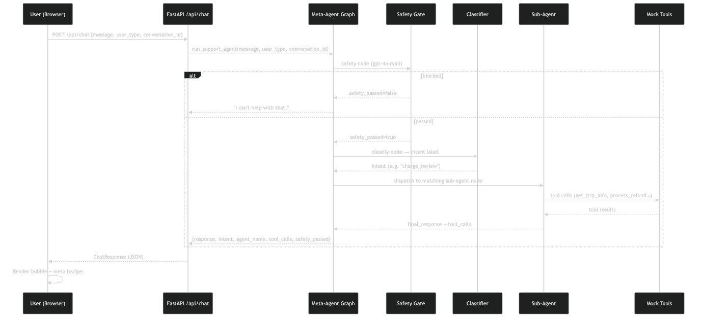
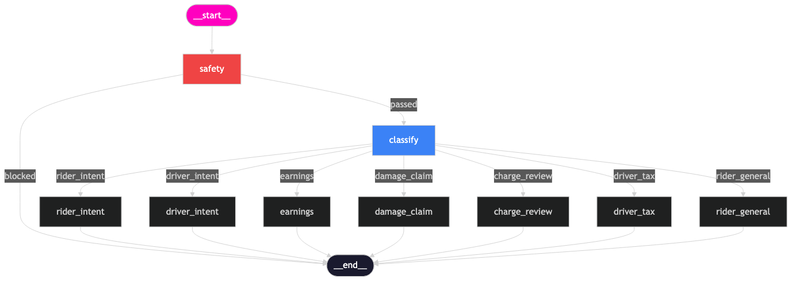
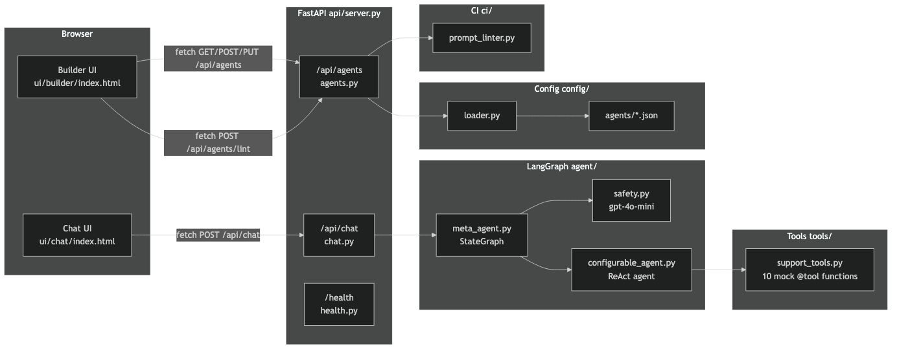
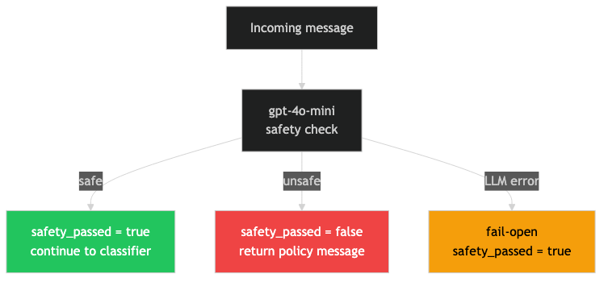
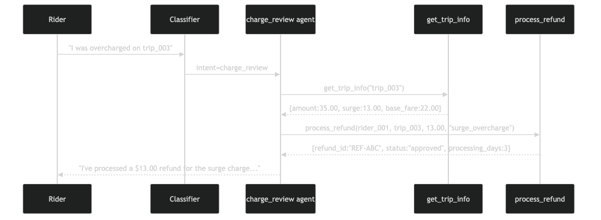
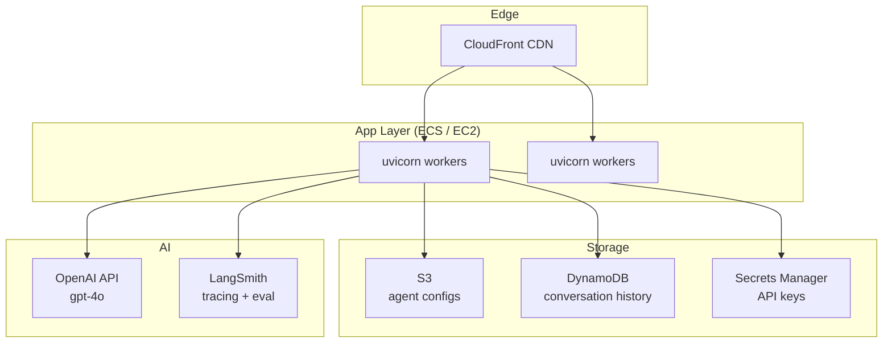

# Architecture

## System Overview

The Lyft Support Agent is a **hierarchical multi-agent system**: a single meta-agent router receives every customer message, applies a safety gate, classifies intent, then dispatches to the correct specialist sub-agent. Sub-agents are defined as JSON configs and loaded dynamically — no redeploy needed.

---

## Full Request Flow

---

## Meta-Agent State Graph

---

## Component Breakdown

---

## Agent Config Lifecycle

---

## Safety Gate Logic

---

## Data Flow for a Charge Dispute

---

## Deployment Architecture (Production Target)

> **Current state**: single uvicorn process, in-memory conversation store, local JSON configs. Replace with the services shown above for production.
