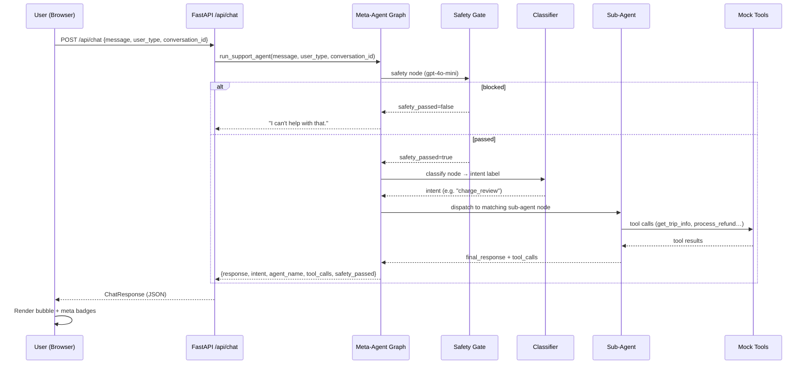
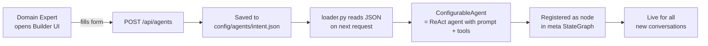
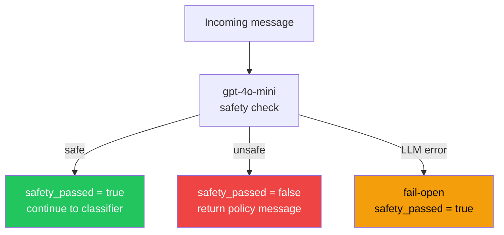
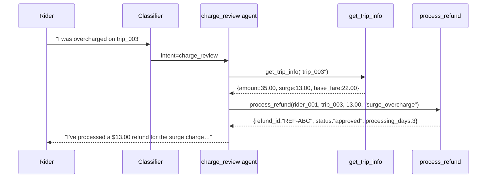
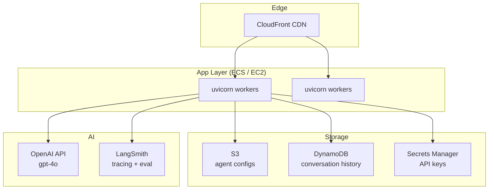

# Architecture

## System Overview

The Lyft Support Agent is a **hierarchical multi-agent system**: a single meta-agent router receives every customer message, applies a safety gate, classifies intent, then dispatches to the correct specialist sub-agent. Sub-agents are defined as JSON configs and loaded dynamically — no redeploy needed.

---

## Full Request Flow



---

## Meta-Agent State Graph

```mermaid
flowchart TD
    START([__start__]) --> safety

    safety -->|blocked| END([__end__])
    safety -->|passed| classify

    classify -->|rider_intent|    rider_intent
    classify -->|driver_intent|   driver_intent
    classify -->|earnings|        earnings
    classify -->|damage_claim|    damage_claim
    classify -->|charge_review|   charge_review
    classify -->|driver_tax|      driver_tax
    classify -->|rider_general|   rider_general

    rider_intent   --> END
    driver_intent  --> END
    earnings       --> END
    damage_claim   --> END
    charge_review  --> END
    driver_tax     --> END
    rider_general  --> END

    style START fill:#FF00BF,color:#fff
    style END   fill:#1a1a2e,color:#fff
    style safety fill:#ef4444,color:#fff
    style classify fill:#3b82f6,color:#fff
```

---

## Component Breakdown

```mermaid
flowchart LR
    subgraph Browser
        CUI[Chat UI\nui/chat/index.html]
        BUI[Builder UI\nui/builder/index.html]
    end

    subgraph FastAPI["FastAPI  api/server.py"]
        CR[/api/chat\nchat.py]
        AR[/api/agents\nagents.py]
        HR[/health\nhealth.py]
    end

    subgraph LangGraph["LangGraph  agent/"]
        MG[meta_agent.py\nStateGraph]
        SG[safety.py\ngpt-4o-mini]
        CA[configurable_agent.py\nReAct agent]
    end

    subgraph Config["Config  config/"]
        CL[loader.py]
        CF[agents/*.json]
    end

    subgraph Tools["Tools  tools/"]
        ST[support_tools.py\n10 mock @tool functions]
    end

    subgraph CI["CI  ci/"]
        PL[prompt_linter.py]
    end

    CUI -->|fetch POST /api/chat| CR
    BUI -->|fetch GET/POST/PUT /api/agents| AR
    BUI -->|fetch POST /api/agents/lint| AR

    CR --> MG
    MG --> SG
    MG --> CA
    CA --> ST

    AR --> CL
    CL --> CF
    AR --> PL
```

---

## Agent Config Lifecycle



---

## Safety Gate Logic



---

## Data Flow for a Charge Dispute



---

## Deployment Architecture (Production Target)



> **Current state**: single uvicorn process, in-memory conversation store, local JSON configs. Replace with the services shown above for production.
